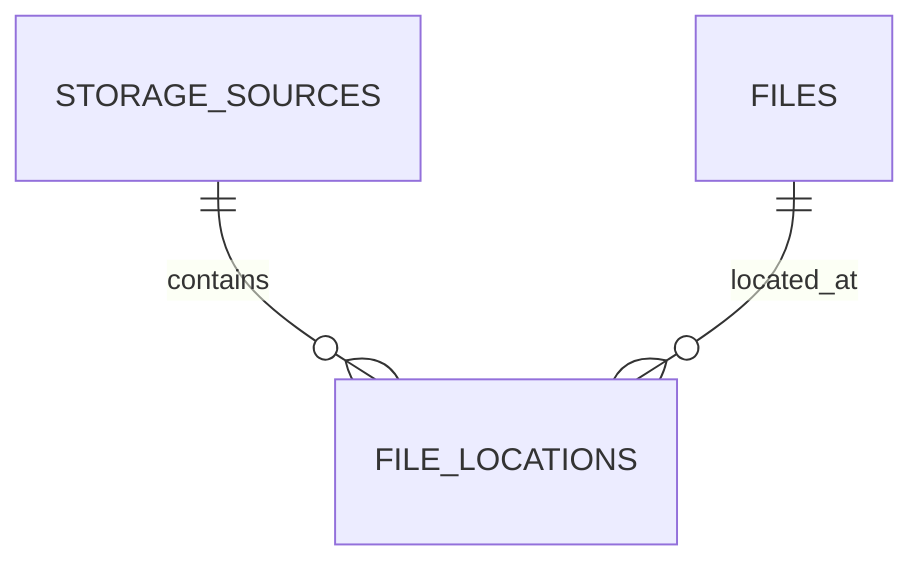

# Database Reference

이 문서는 현재 DB Schema와 Entity가 일치하도록 유지하는 레퍼런스다.

정확한 컬럼은 Repository의 DDL을 Source of truth로 한다.

## 핵심 관계



## storage_sources

연결된 Storage 단위를 나타낸다.

핵심 개념:

- Provider/Device 종류
- 표시 이름
- 마지막 Metadata Sync 시각

## files

논리적인 File Metadata다.

Location과 분리한다.

## file_locations

File이 어떤 Storage에 실제 존재하는지 표현한다.

반복 Sync 유일성:

```text
UNIQUE(storage_source_id, external_id)
```

이 Unique Key는 cross-storage deduplication 기준이 아니다.

## storage_credentials

과거 Backend Provider Credential 설계에서 사용한 테이블이 코드/DDL에 존재할 수 있다.

현재 인증 경계에서는 Provider Token을 Backend의 기본 영속 상태로 두지 않는다.

따라서 이 테이블이 현재 Repository에 남아 있다면:

- 기존 코드 호환용인지
- 제거 예정인지
- Ariadne 자체 Credential 용도로 재사용할지

를 별도 Decision 없이 확장하지 않는다.

## 변경 규칙

Entity 변경 시:

1. DDL 확인
2. Migration/Init SQL 변경
3. Mapping Validation
4. 이 문서 갱신
5. Domain 문서 갱신
